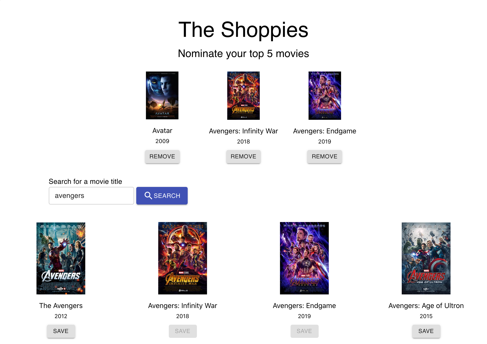

# The Shoppies (OMDB Movie Search)

This web application was created in response to a coding challenge for a front-end developer position. The site uses the OMDB API to search for and display movies based on a user's query. The user has the ability to save/remove movies from their favorites list. This is possible because of a remote MongoDB Atlas database.

If a movie is added to the favorites list, its save button will be disabled, preventing duplicate movies. If it is removed from the list, its save button will be re-enabled.

## Screenshots

   
## Deployed Application
* <a href='https://shoppies-movie-search.herokuapp.com/'>Deployed App</a>

## Technologies
* HTML
* CSS
* Javascript
* Node.js
* Express
* React
* React-dom
* Axios
* CORS
* Dotenv
* If-env
* Concurrently
* Mongoose
* MongoDB Atlas
* OMDB (API)
* Material-UI
* Heroku
  
## Portfolio
<a href="https://kdoh52.github.io/" target="_blank">Updated portfolio</a>

## Contact
* kdoh52@gmail.com
